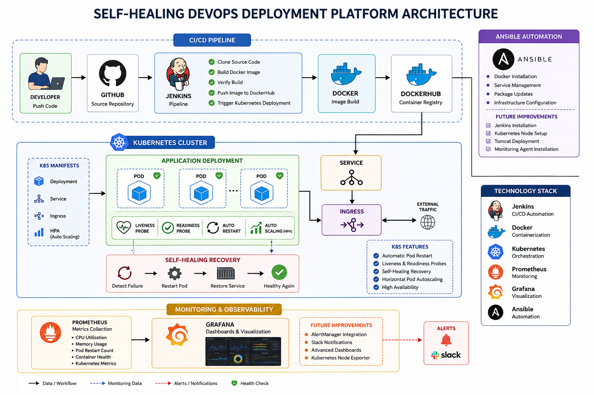

# Self-Healing DevOps Deployment Platform

A cloud-native DevOps automation platform designed to demonstrate CI/CD automation, Kubernetes self-healing capabilities, infrastructure monitoring, and container orchestration using Jenkins, Docker, Kubernetes, Prometheus, and Grafana.


---

# Project Overview

This project automates the software deployment lifecycle using Jenkins pipelines and Kubernetes orchestration.

The platform is capable of:

- Automating Docker image build and deployment
- Deploying applications into Kubernetes clusters
- Performing self-healing recovery using Kubernetes probes
- Monitoring infrastructure and container health
- Visualizing metrics using Grafana dashboards
- Simulating failure recovery scenarios



---

# Architecture

```text
Developer Push
       ↓
    GitHub
       ↓
    Jenkins Pipeline
       ↓
 Docker Image Build
       ↓
   DockerHub
       ↓

```

# Ansible Automation

This directory contains Ansible playbooks used for infrastructure automation and server configuration.

## Current Automation Tasks

- Docker installation
- Service management
- Package updates
- Infrastructure configuration

## Future Improvements

- Jenkins installation automation
- Kubernetes node setup
- Tomcat deployment automation
- Monitoring agent installation
 Kubernetes Cluster
       ↓
Self-Healing Recovery
       ↓
Prometheus + Grafana

# CI/CD Workflow

## Jenkins Pipeline

Jenkins is used to automate the CI/CD workflow of the platform.

### Pipeline Stages

- Clone source code from GitHub
- Build Docker image
- Verify Docker build
- Push image to DockerHub
- Trigger Kubernetes deployment

### Jenkins Features

- Automated build execution
- Continuous Integration workflow
- Pipeline-based deployment automation
- Integration with Docker and Kubernetes

---

# Docker Containerization

Docker is used to package the application and its dependencies into portable containers.

## Docker Workflow

- Build container image using Dockerfile
- Store image in DockerHub repository
- Deploy containers inside Kubernetes cluster

## Docker Features

- Lightweight containerized deployments
- Consistent runtime environments
- Faster application deployment
- Simplified dependency management

---

# Kubernetes Orchestration

Kubernetes is used to manage, scale, and recover application containers automatically.

## Kubernetes Components Used

- Deployment
- Service
- Ingress
- Horizontal Pod Autoscaler (HPA)

## Self-Healing Features

- Automatic pod restart
- Liveness probes
- Readiness probes
- Auto-scaling based on CPU usage

## Kubernetes Workflow

1. Pull container image from DockerHub
2. Deploy application pods
3. Expose services internally
4. Route external traffic using Ingress
5. Monitor pod health
6. Restart failed containers automatically

# Monitoring Setup

This directory contains monitoring configurations used for infrastructure observability and container health tracking.

## Monitoring Tools

- Prometheus
- Grafana

## Metrics Monitored

- CPU utilization
- Memory usage
- Pod restart count
- Container health

## Future Improvements

- AlertManager integration
- Slack notifications
- Advanced Grafana dashboards
- Kubernetes node exporter
